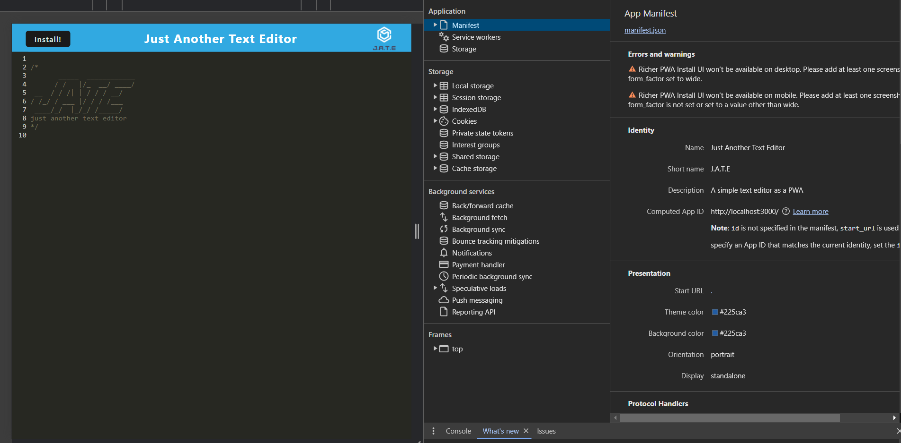
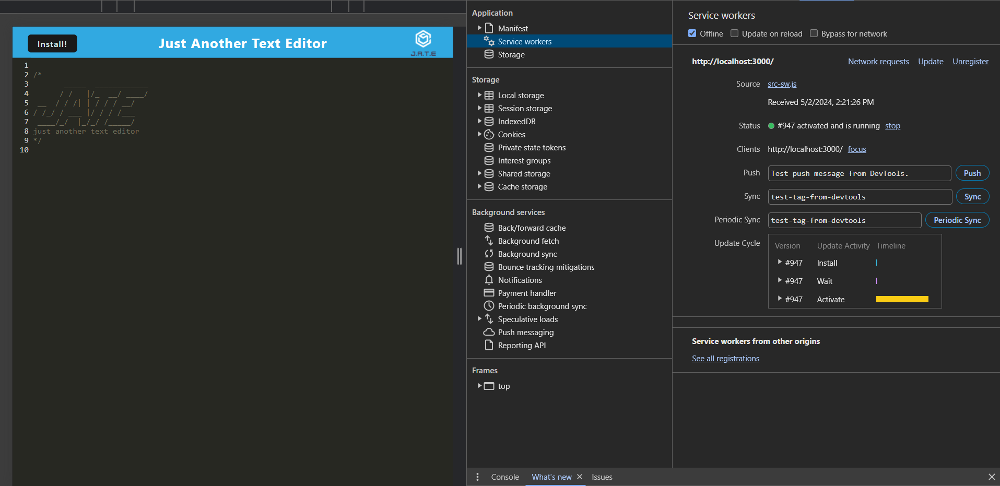
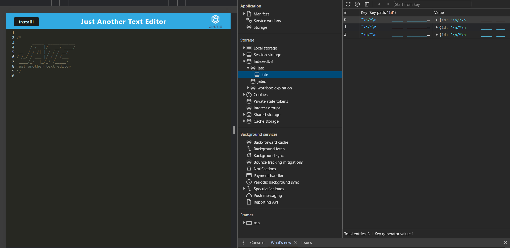

# Text-Editor-PWA

## Table of Contents
- [Overview](#overview)
- [Features](#features)
- [Installation](#installation)
- [Usage](#usage)
- [Screenshots](#screenshots)
- [Contributing](#contributing)
- [License](#license)

## Overview

This browser-based text editor is a robust single-page application designed as a Progressive Web Application (PWA). It features advanced data persistence techniques to ensure reliability and availability, even when offline. Built upon a lightweight wrapper around the IndexedDB API called `idb`, this editor offers seamless and efficient data storage and retrieval.

## Features

- **PWA Compliance**: Meets all the criteria for Progressive Web Apps, ensuring a full-featured app experience with offline capability.
- **Data Persistence**: Utilizes the `idb` package for IndexedDB integration, providing multiple layers of data redundancy to handle scenarios where a browser might not support certain features.
- **Offline Functionality**: Fully functional offline, making it ideal for environments with unstable internet connections.
- **Modern UI**: Sleek, user-friendly interface that is easy to navigate and use, even for beginners.

## Installation

To get started with this text editor, follow the steps below:

1. Clone the repository:
   ```bash
   git clone https://github.com/anicabarrios/Text-Editor-PWA

2. Navigate to the project directory:
`cd your-project-directory`,

3. Install the required dependencies:
`npm install`

# Usage

To run the text editor, simply execute the following command in the project root directory:

```bash
npm start
```
This will launch the text editor in your default web browser. The app can be accessed at `http://localhost:3000.

## Screenshots
The following image shows the application's manifest.json file:



The following image shows the application's registered service worker:


The following image shows the application's IndexedDB storage:


The following image shows the application's cache storage:


## Contributing

Contributions to improve the text editor are welcome. Please follow these steps to contribute:

1. Fork the repository.
2. Create a new branch for your feature (`git checkout -b feature/YourFeature`).
3. Commit your changes (`git commit -m 'Add some feature'`).
4. Push to the branch (`git push origin feature/YourFeature`).
5. Open a pull request.

## License

This project is licensed under the MIT License.